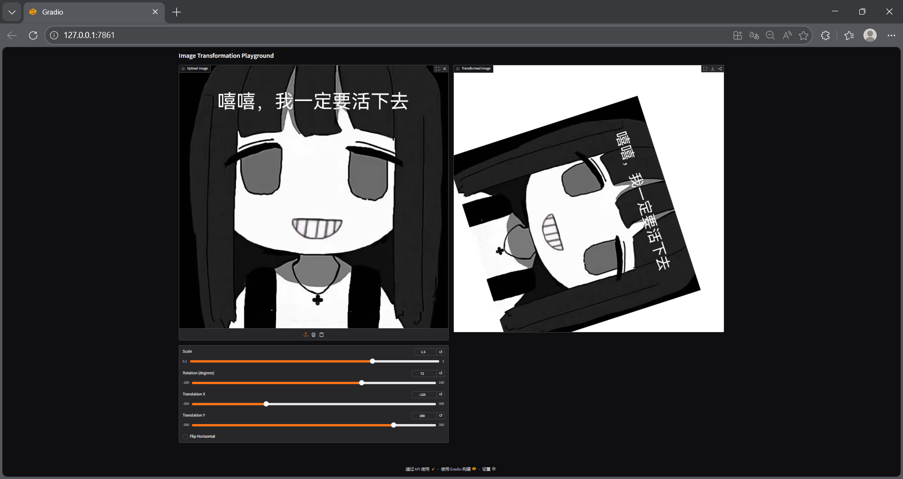
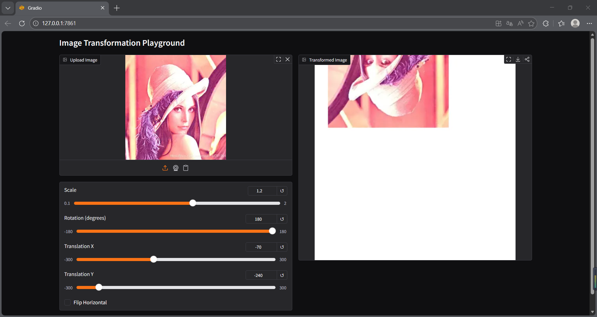
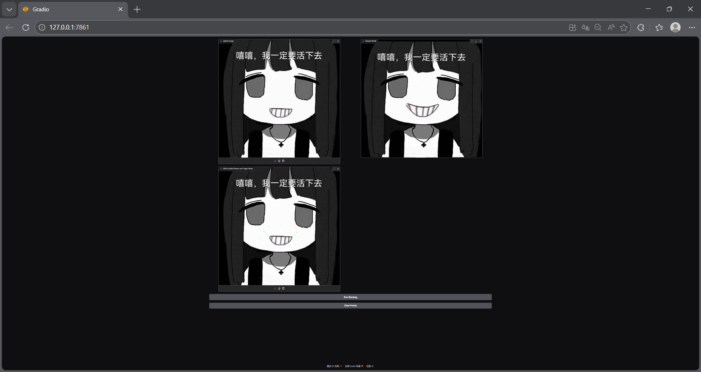
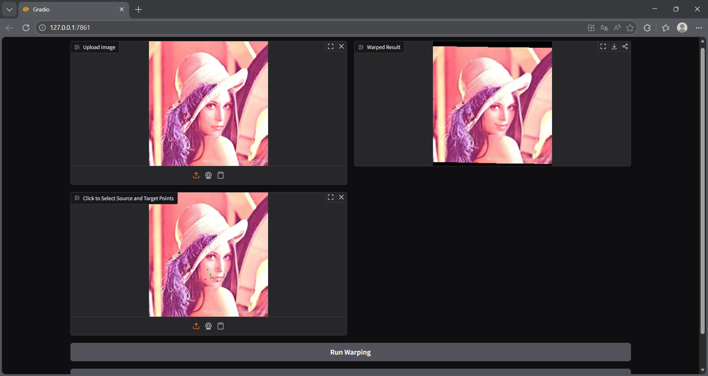

# Assignment 1: Image Wraping

## 环境及配置

本地环境：python 3.10.1

额外库安装：
```
python -m pip install -r requirements.txt
```

**如果上述代码无法运行，可以将上述代码中的```requirements.txt```改为该文件的绝对路径并运行**

## 代码运行

本次作业包含两部分，若需运行全局变换，可运行代码
```
python run_global_transform.py
```

若需运行局部变换，可运行代码
```
python run_point_transform.py
```

**如果上述代码无法运行，可以将上述代码中的```run_global_transform.py```或```run_point_transform.py```改为该文件的绝对路径并运行**

## 结果展示

结果展示使用了两张图片，分别运行两部分的代码，得到的结果截图。完整的结果展示请查看```pics```文件夹。

### 全局变换展示





### 局部变换展示





## 致谢

> 本项目基于[Image Deformation Using Moving Least Squares](https://people.engr.tamu.edu/schaefer/research/mls.pdf)中的代码实现。

> 本项目中使用的部分示例图片来源于网络，原作者不详，仅用于技术演示和学习使用。如有版权问题，请联系删除。