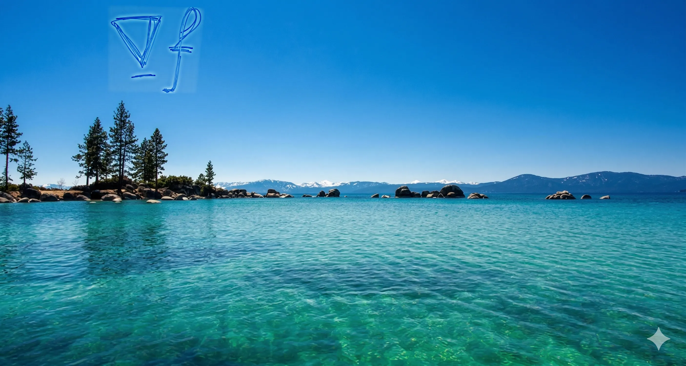
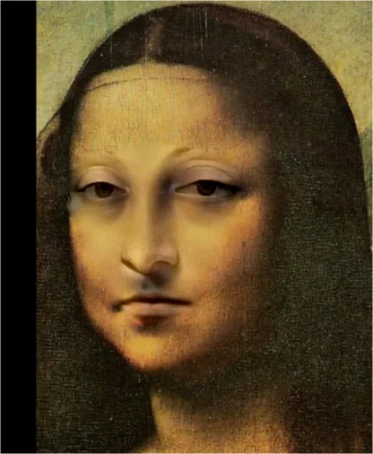
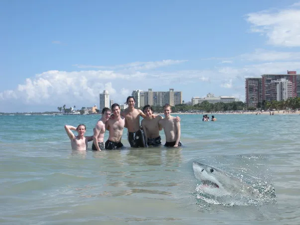
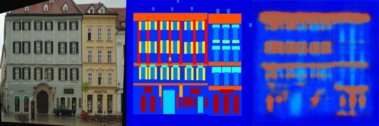
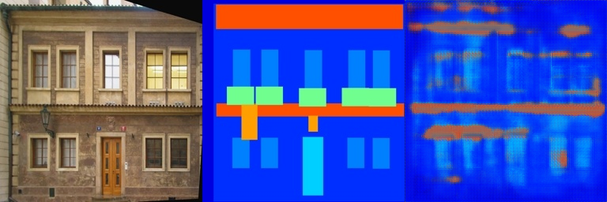
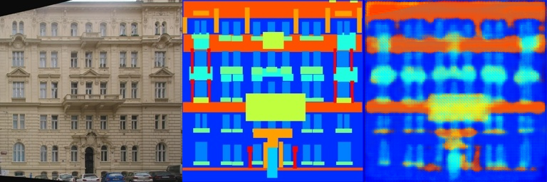
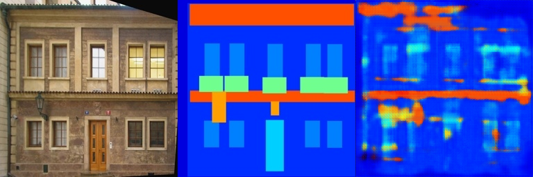

# Assignment 2: Traditional / DeepLearning DIP with PyTorch

## 环境及配置

本地环境：python 3.10.1

pyTorch版本：2.11.0+cpu

额外库安装：
```
python -m pip install -r requirements.txt
```

pyTorch安装：可访问官网并选择环境
```
https://pytorch.org/
```

## 代码运行

本次作业包含两部分，若需运行 poisson 图片编辑部分，可将子文件夹 [poisson_image_edition](poisson_image_edition/) 设置为工作区并运行代码
```
python run_blending_gradio.py
```

若需运行图片翻译部分，可将子文件夹 [Pix2Pix](Pix2Pix/) 设置为工作区并运行代码
```
bash download_facades_dataset.sh
python train.py
```

**代码需运行约100分钟，时间较长，如果观察到过拟合发生可提前结束代码运行**

需要说明的是，由于环境配置不同等多重原因，部分原代码在笔者的本地环境中无法运行，对此做出了以下修改：

1、将文件```download_facades_dataset.sh```第7行```wget -N $URL -O $TAR_FILE```改为```curl -N $URL -o $TAR_FILE```

2、将文件```run_blending_gradio.py```开头库导入部分```import torch```移至```import gradio```前（先导入 gradio 再导入 torch 会报错 ```OSError: [WinError 1114] 动态链接库(DLL)初始化例程失败```）
<!-- 奇怪的 bug 害我修了一天 -->

## 结果展示

### poisson 图片编辑

结果展示使用了三组图片，完整的结果展示请查看子文件夹 [poisson_image_edition/results/](poisson_image_edition/results/)







### 图片翻译

代码约在 40-60 epoch 出现过拟合现象，之后验证损失几乎不再下降，以下是过拟合分析。


以下分别是 50 epoch 时的训练结果和验证结果展示，可以观察到训练结果和验证结果效果相当。





以下分别是 150 epoch 时的训练结果和验证结果展示，可以观察到训练结果明显优于验证结果，出现过拟合现象。





## 参考文献

- [Paper: Poisson Image Editing](https://www.cs.jhu.edu/~misha/Fall07/Papers/Perez03.pdf)

- [Paper: Image-to-Image Translation with Conditional Adversarial Nets](https://phillipi.github.io/pix2pix/)

- [Paper: Fully Convolutional Networks for Semantic Segmentation](https://arxiv.org/abs/1411.4038)

## 致谢

> 本项目中使用的训练数据来源于[网址链接](https://github.com/phillipi/pix2pix?tab=readme-ov-file)。

> 本项目中使用的部分示例图片来源于网络，原作者不详，仅用于技术演示和学习使用。如有版权问题，请联系删除。