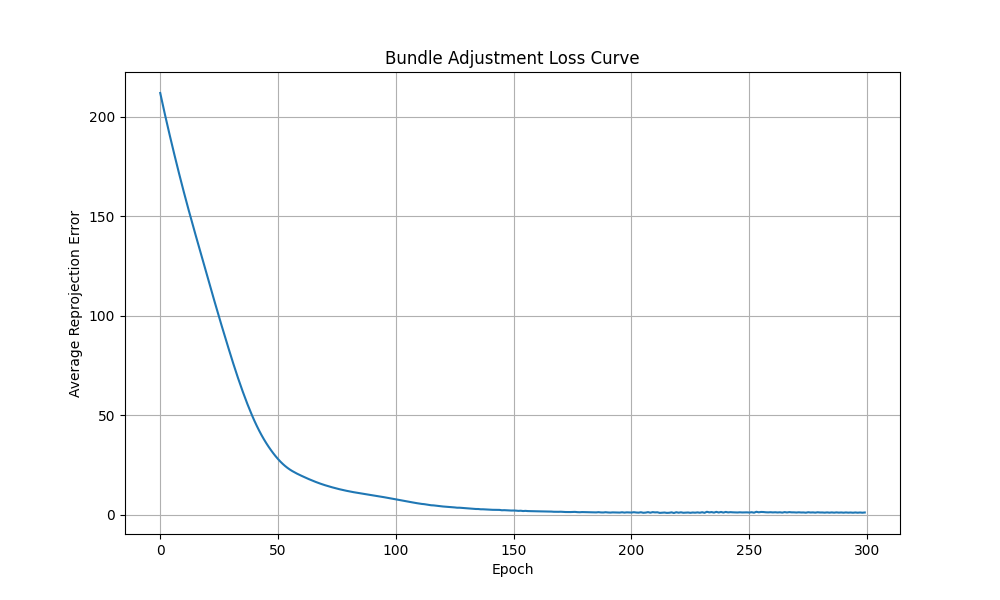
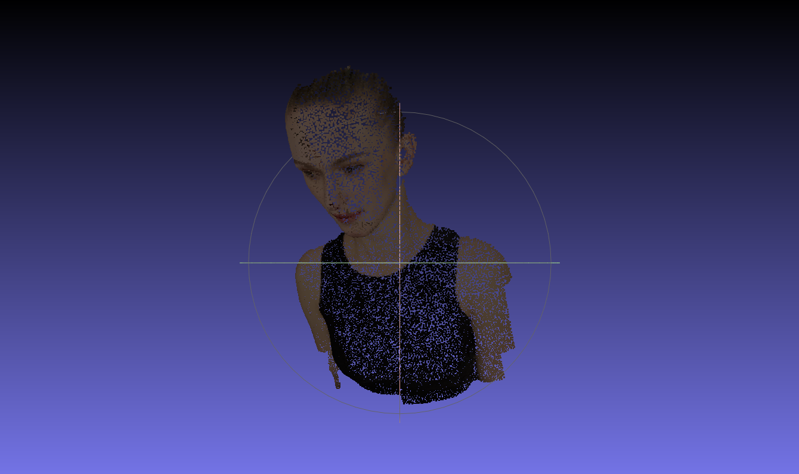
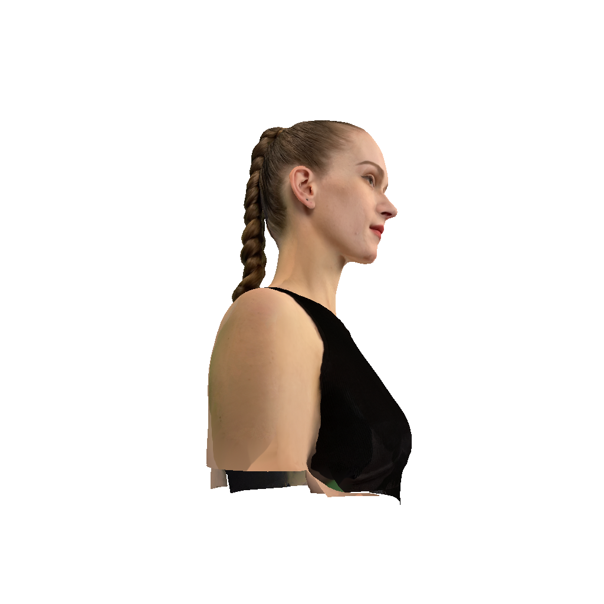

# Assignment 3: Bundle Adjustment

## 环境及配置

本地环境：python 3.10.1

pyTorch版本：2.11.0+cpu

额外库安装：
```
python -m pip install -r requirements.txt
```

pyTorch安装：可访问 [官网](https://pytorch.org/) 并选择对应环境

colmap安装：可访问 [链接](https://github.com/colmap/colmap/releases) 并根据有无GPU下载对应版本，解压后将其中的文件夹 `\bin` 加入系统变量中的 Path 中。

## 代码运行

本次作业包含两部分，若需运行基于 pyTorch 的 Bundle Adjustment 部分，可运行代码
```
python bundle_adjustment.py
```

若需运行基于 colmap 的三维重建部分，可运行代码
```
bash run_colmap.sh
```

## 结果展示

### 基于 pyTorch 的 Bundle Adjustment

完整的结果请查看子文件夹 [output/](output/)。其中文件 [loss_curve.png](output/loss_curve.png) 是优化过程中 loss 的变化曲线，文件 [reconstructed_point_cloud.obj](output/reconstructed_point_cloud.obj) 是最终重建的 3D 点云，文件 [reconstructed_point_cloud.png](output/reconstructed_point_cloud.png) 是使用 MeshLab 渲染出的重建点云结果截图，文件 [camera_parameters.txt](output/camera_parameters.txt) 是最终计算出的相机参数，包含焦距、。

以下是 loss 曲线和重建结果展示。





### 基于 colmap 的三维重建

由于硬件限制（无GPU），本任务只完成了 step 1 - step 4（包含特征提取、特征匹配、稀疏重建和图像去畸变），step 5 和 step 6 并未完成（包含稠密重建和立体融合）。

完整的结果请查看子文件夹 [data/colmap/](data/colmap/)。其中文件夹 [sparse/0/](data/colmap/sparse/0/) 是稀疏重建的结果，文件夹 [dense/images/](data/colmap/dense/images/) 是图像去畸变的结果。

以下是去畸变后的图像展示。



## 致谢

> 本项目中使用的部分示例图片来源于网络，原作者不详，仅用于技术演示和学习使用。如有版权问题，请联系删除。