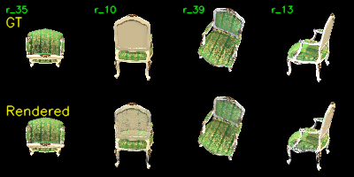

# Assignment 4: 3DGS

## 环境及配置

本次实验对配置要求较高，task 1 （COLMAP 稀疏重建）在本地完成，task 2 （简化版 3DGS 训练）和 task 3 （官方 3DGS 对比）在服务器上完成。以下分别介绍 task 1 和 task 2 的软硬件配置及依赖环境。而 task 3 的配置及环境可以访问 [链接](https://github.com/graphdeco-inria/gaussian-splatting) 查看。

### task 1

Python 版本：Python 3.10.1

COLMAP 版本：COLMAP 4.0.3

额外库版本：numpy 1.26.4, opencv-python 4.10.0

额外库安装：
```
python -m pip install -r requirements_1.txt
```

colmap安装：可访问 [链接](https://github.com/colmap/colmap/releases) 并根据有无GPU下载对应版本，解压后将其中的文件夹 `\bin` 加入系统变量中的 Path 中。

### task 2

Python 版本：Python 3.10.8

PyTorch 版本：PyTorch 2.1.2+cu121

额外库版本：numpy 1.26.3, opencv-python 4.11.0, tqdm 4.64.1, natsort 8.4.0

额外库安装：
```
python -m pip install -r requirements_2.txt
```

PyTorch安装：可访问 [官网](https://pytorch.org/) 并选择对应环境

## 代码介绍

### task 1

本任务的目标是使用 COLMAP 工具对输入的多视角图像进行运动恢复结构重建，目的是恢复相机参数（包括内参和外参）并生成稀疏点云（作为后续任务的初始化）。

在运行代码前，需要确保当前文件夹下有子文件夹 [images](data/chair/images/) 且其下有多视角图像。

在终端中运行以下命令，[脚本](mvs_with_colmap.py) 会自动调用 COLMAP 进行特征提取、特征匹配和稀疏重建：

```
python mvs_with_colmap.py --data_dir data/chair
```

该命令会创建子文件夹 [sparse](data/chair/sparse/) 并在其下存储结果。

重建完成后，运行以下命令，[脚本](debug_mvs_by_projecting_pts.py) 会将恢复的 3D 点重投影回各视角的 2D 图像上，以肉眼检查相机参数和点云的准确性：

```
python debug_mvs_by_projecting_pts.py --data_dir data/chair
```

该命令会创建子文件夹 [projections](data/chair/projections/) 并在其下存储可视化结果。

### task 2

本任务的目标是使用 PyTorch 工具，在 task 1 获得稀疏点云和相机参数的基础上，将每个稀疏点扩展为一个可优化的 3D 高斯椭球，并通过可微分光栅化实现端到端的场景渲染。

在终端中运行以下命令，运行 [训练脚本](train.py)，启动 200 轮迭代优化：

```
python train.py --colmap_dir data/chair --checkpoint_dir data/chair/checkpoints
```

该命令会创建子文件夹 [checkpoints](data/chair/checkpoints/) 并在其下存储结果。需要注意的是，这条命令运行时间较长（在 RTX 4090D 上运行时间约 3 小时）。

训练完成后，可运行 [脚本](render_3dgs_mv.py) 生成一个水平环绕轨迹的渲染 [视频](data/chair/render_mv.mp4)，便于直观检查重建质量：

```
python render_3dgs_mv.py \
    --colmap_dir data/chair \
    --checkpoint data/chair/checkpoints/checkpoint_000060.pt \
    --num_frames 240 --fps 30
# 默认输出: <colmap_dir>/render_mv.mp4
```

### task 3

本任务的目标是将 task 2 中实现的纯 PyTorch 简化版 3DGS 与官方原版实现的 3DGS 进行系统性对比。官方代码见 [网址](https://github.com/graphdeco-inria/gaussian-splatting)。

## 结果分析

简化版和官方 3DGS 在相同配置的服务器上运行，以便进行对比实验。显卡配置为 RTX 4090D。

### 结果展示

以下先展示简化版200次迭代、官方版7000次迭代和官方版30000次迭代的部分结果。

以下是简化版200次迭代的结果展示。



以下是官方版7000次迭代的结果展示。


以下是官方版30000次迭代的结果展示。


### 渲染质量

以下是三个版本的 PSNR 值对比。

| 指标 | 简化版200次迭代 | 官方版7000次迭代 | 官方版30000次迭代 |
| :--- | :---: | :---: | :---: |
| PSNR ↑ (dB) | 8.8071 | 11.3776 | 3.8171 |

可以看到，简化版由于使用了下采样，实际分辨率降为 100×100 ，导致其画质较低，使得 PSNR 值较低。而官方实现使用的是原始 800×800 的分辨率，画质较高。然而，官方版在迭代的过程中，产生了类似“过曝”的现象，图片中大量区域的亮度显著提高，导致其 PSNR 值反而逐渐降低。

### 训练速度

以下是简化版200次迭代和官方版30000次迭代的运行时间对比。

| 指标 | 简化版200次迭代 | 官方版30000次迭代 |
| :--- | :---: | :---: |
| 运行时间 ↓ | ~3h | ~6min |

可以看到，即使官方版进行了30000次迭代，依然在约6分钟内完成了运行，每次迭代时间约为0.012秒。而简化版每次迭代时间约为52秒，仅进行200次迭代就花费了约3小时。

### 显存占用

以下是简化版和官方版的显存占用对比。

| 指标 | 简化版 | 官方版 |
| :--- | :---: | :---: |
| 显存占用 ↓ (GB) | ~4-6 | ~8-10 |

可以看到，官方版的显存约为简化版的2倍，而官方版的输入采用的是 800×800 的分辨率，简化版采用的是 100×100 的分辨率。相较之下，如果使用相同分辨率的输入，官方版可能有更低的显存占用。

### 总结

整体来看，官方版的结果产生了类似“过曝”的问题，导致 PSNR 值在一定次数的迭代后反而逐渐降低。在训练速度上，官方版有绝对的优势（每次迭代时间差约4500倍）。在显存占用上，由于采用不同分辨率的输入，无法得到明确的结论，但官方版显存占用较低的概率更大。

## 致谢

> 本项目基于论文 [3D Gaussian Splatting for Real-Time Radiance Field Rendering](https://repo-sam.inria.fr/fungraph/3d-gaussian-splatting/3d_gaussian_splatting_low.pdf) 实现。

> 本项目中使用的“官方版 3DGS ”来自于 [网址](https://github.com/graphdeco-inria/gaussian-splatting) 。

> 本项目中使用的部分示例图片来源于网络，原作者不详，仅用于技术演示和学习使用。如有版权问题，请联系删除。